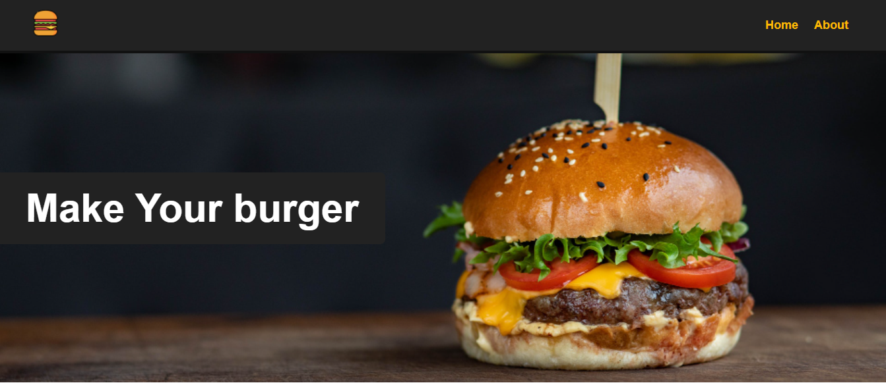

<h1> Make your burger <h1>
<h2 align="center">Tópicos 📋</h2>

   <p>
   
   - [ about 📖 ](#about-)
   - [ Layout 🎨 ](#layout-)
   - [ how to use 🤔 ](#how-to-use-)

   </p>

<h2 align="center">About 📖</h2>
   
<p>
   The Make your burger project, developed with Vue.js and Json server to simulate a database on the backend, is an application designed to manage hamburger orders.
</p> 

<h2 align="center">Layout Home 🎨</h2>

<p align="center">
  
</P>


<h2 align="center">Make your wish 🎨</h2>

<p align="center">

</p>

<h2 align="center">Dashboard🎨</h2>

<p align="center">

</p>

<h2 align="center">How to use 🤔</h2>

```

- Clonar esse direito:
   $ https://github.com/Roberto-frontend-developer/make_your_burger.   gitmake_your_burger
   - Instale como dependências:
     $ npm install
     $ json server
   - inicie o aplicativo:
     $ npm run serve
```
